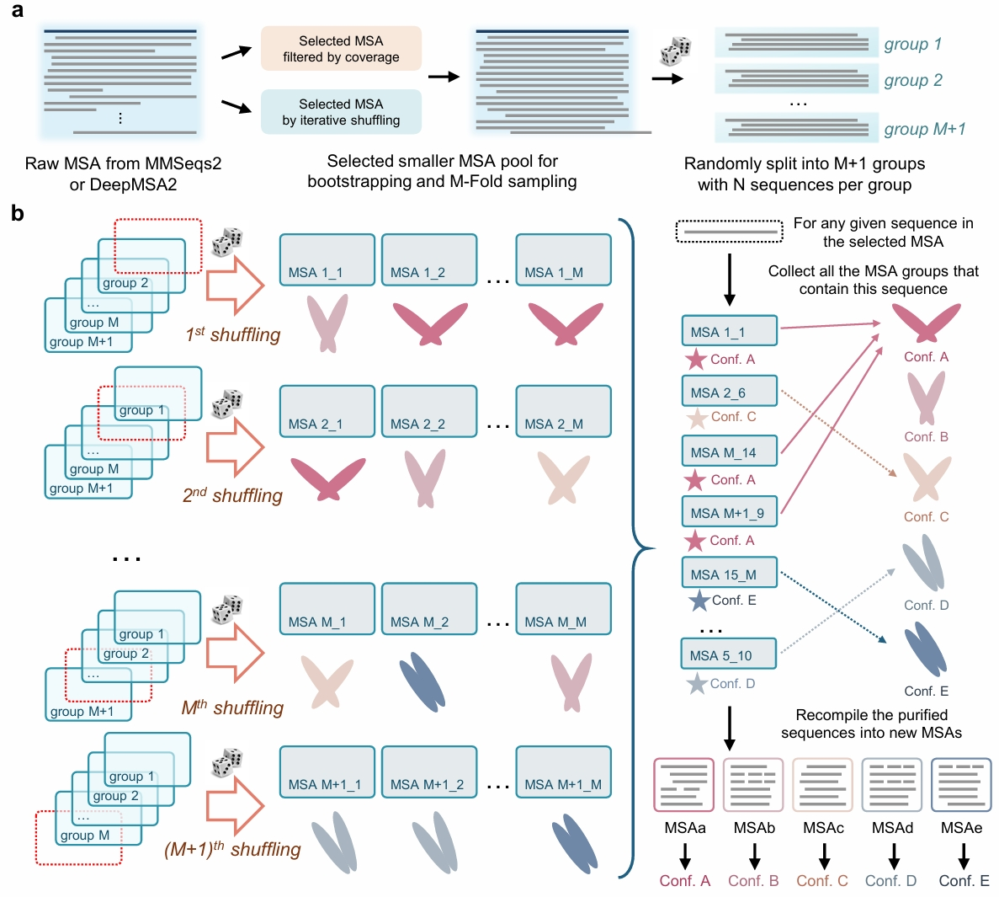

# AF-ClaSeq: Leveraging Sequence Purification for Accurate Prediction of Multiple Conformational States with AlphaFold2

AF-ClaSeq is a comprehensive pipeline for protein structure prediction and analysis that leverages sequence purification to accurately predict multiple conformational states using AlphaFold2.

## Overview



AlphaFold2 (AF2) has transformed protein structure prediction by harnessing co-evolutionary constraints embedded in multiple sequence alignments (MSAs). MSAs not only encode static structural information, but also hold critical details about protein dynamics, which underpin biological functions. However, these subtle co-evolutionary signatures, which dictate conformational state preferences, are often obscured by noise within MSA data and thus remain challenging to decipher. Here, we introduce AF-ClaSeq, a systematic framework that isolates these co-evolutionary signals through sequence purification and iterative enrichment. By extracting sequence subsets that preferentially encode distinct structural states, AF-ClaSeq enables high-confidence predictions of alternative conformations. Our findings reveal that the successful sampling of alternative states depends not on MSA depth but on sequence purity. Intriguingly, purified sequences encoding specific structural states are distributed across phylogenetic clades and superfamilies, rather than confined to specific lineages. Expanding upon AF2's transformative capabilities, AF-ClaSeq provides a powerful approach for uncovering hidden structural plasticity, advancing allosteric protein and drug design, and facilitating dynamics-based protein function annotation.

## Features

- **Iterative Shuffling and Enrichment**: Systematically enriches sequences through multiple iterations based on structural metrics
- **M-fold Sampling**: Creates and analyzes multiple sequence groups to explore conformational landscapes
- **Sequence Voting**: Identifies sequences that consistently contribute to specific conformational states
- **Recompilation & Prediction**: Generates purified MSAs for targeted structure prediction
- **Comprehensive Visualization**: Provides detailed analysis tools across all pipeline stages

## Installation

### Prerequisites

- Python 3.10+
- SLURM-enabled compute cluster (for large-scale predictions)
- ColabFold installation (see [ColabFold repository](https://github.com/sokrypton/ColabFold))
- TM-align program (available from [TM-align website](https://zhanggroup.org/TM-align/))

### Installation Options

#### Using Poetry (Recommended)

```bash
# Clone the repository
git clone https://github.com/enmingxing244/AF_ClaSeq.git
cd AF_ClaSeq

# Install with Poetry
poetry install
```

#### Using pip

```bash
# Clone the repository
git clone https://github.com/enmingxing244/AF_ClaSeq.git
cd AF_ClaSeq

# Install with pip
pip install -e .
```

## Pipeline Workflow

AF-ClaSeq consists of five main stages:

1. **Iterative Shuffling** (`01_ITER_SHUF_RUN` & `01_ITER_SHUF_ANALYSIS`): Enriches sequences based on structural metrics through multiple iterations
2. **M-fold Sampling** (`02_M_FOLD_SAMPLING_RUN` & `02_M_FOLD_SAMPLING_PLOT`): Performs multiple rounds of sequence sampling
3. **Sequence Voting** (`03_VOTING_RUN`): Analyzes which sequences contribute to specific conformational states
4. **Recompilation & Prediction** (`04_RECOMPILE_PREDICT_RUN`): Recompiles selected sequences and predicts structures
5. **Analysis & Visualization** (`05_PURE_SEQ_PLOT_RUN`): Creates comprehensive visualizations

## Usage

### Basic Usage

The pipeline is executed using the `run_af_claseq_pipeline.py` script with a YAML configuration file:

```bash
python run_af_claseq_pipeline.py config_run.yaml
```

### Configuration Files

AF-ClaSeq requires two configuration files:

1. **YAML Configuration File** (`config_run.yaml`): Controls pipeline execution parameters
2. **JSON Filter Configuration** (`config.json`): Defines structural metrics and filters

#### YAML Configuration File Structure

The YAML configuration file contains several sections:

```yaml
# Main configuration sections
general:                   # Basic parameters and file paths
slurm:                     # SLURM job submission parameters
pipeline_control:          # Stages to execute and control parameters
iterative_shuffling:       # Parameters for iterative shuffling stage
m_fold_sampling:           # Parameters for M-fold sampling stage
sequence_voting:           # Parameters for sequence voting stage
recompile_predict:         # Parameters for recompilation and prediction stage
pure_sequence_plotting:    # Parameters for analysis and visualization
```

**Key Sections Explained:**

**General Section**
```yaml
general:
  # Input MSA file for the pipeline
  source_a3m: "path/to/input.a3m"
  # Reference PDB structure for analysis
  default_pdb: "path/to/reference.pdb"
  # Base directory for all pipeline outputs
  base_dir: "run_directory"
  # JSON file containing filter criteria definitions
  config_file: "path/to/config.json"
  # Name of the protein being analyzed
  protein_name: "MyProtein"
  # Minimum coverage required for sequence alignment
  coverage_threshold: 0.8
  # Number of models to generate per prediction
  num_models: 1
  # Random seed for reproducibility
  random_seed: 42
  # Number of bins for histogram analysis
  num_bins: 30  
  # Colors for plots
  plot_initial_color: "#87CEEB"
  plot_end_color: "#FFFFFF"
```

**SLURM Section**
```yaml
slurm:
  # Path to conda environment
  conda_env_path: "/path/to/conda/env/"
  # SLURM account for job submission
  slurm_account: "your_account"
  # Various SLURM job parameters
  slurm_output: "/dev/null"
  slurm_error: "/dev/null"
  slurm_nodes: 1
  slurm_gpus_per_task: 1
  slurm_tasks: 1
  slurm_cpus_per_task: 4
  slurm_time: "04:00:00"
  slurm_partition: "your_partition"
  # Maximum number of concurrent workers
  max_workers: 64
```

**Pipeline Control Section**
```yaml
pipeline_control:
  # Pipeline stages to execute
  stages:
    - "01_ITER_SHUF_RUN"       # Run iterative shuffling
    - "01_ITER_SHUF_ANALYSIS"  # Analyze iterative shuffling results
    - "02_M_FOLD_SAMPLING_RUN" # Run M-fold sampling
    - "02_M_FOLD_SAMPLING_PLOT" # Plot M-fold sampling results
    - "03_VOTING_RUN"          # Run sequence voting
    - "04_RECOMPILE_PREDICT_RUN" # Recompile and predict structures
    - "05_PURE_SEQ_PLOT_RUN"   # Generate plots
  # Interval (seconds) to check job status
  check_interval: 60
```

**Stage-Specific Parameters**

Each pipeline stage has its own parameters section. For example:

```yaml
iterative_shuffling:
  # Input MSA file
  iter_shuf_input_a3m: "path/to/input.a3m"
  # Number of iterations
  num_iterations: 8
  # Number of shuffles per iteration
  num_shuffles: 10
  # Number of sequences per shuffle
  seq_num_per_shuffle: 16
  # Minimum pLDDT score threshold
  plddt_threshold: 75
  # Filter criteria for enrichment
  enrich_filter_criteria: ["tmscore_to_structureA"]
  # Quantile threshold for filtering
  quantile: 0.2
  # Resume from a specific iteration (null to start fresh)
  resume_from_iter: null
  # Plot parameters
  iter_shuf_plot_num_cols: 4
  iter_shuf_plot_x_min: 0.4
  # ... other plotting parameters
```

#### JSON Filter Configuration Structure

The JSON configuration file defines structural metrics and filters for comparing predicted structures. This is a critical component as it determines how you will be measuring the structural metrics, adn what metrics you will be using for iterative shuffling enrichment and voting.

```json
{
  "basics": {
    "full_index": {"start": 1, "end": 218}
  },
  "filter_criteria": [
    {
      "name": "metric_name",
      "type": "metric_type",
      "method": "filtering_method",
      "additional_parameters": "value"
    }
  ]
}
```

**Common Components:**

- `basics`: Defines basic parameters such as residue ranges
  - `full_index`: Residue range for the entire protein in the prediction scale
  - `local_index` (optional): Specific region for local pLDDT calculation

- `filter_criteria`: Array of metrics used to evaluate and filter structures
  - `name`: Identifier for the metric (used in plots and analysis)
  - `type`: Type of structural metric (see below)
  - `method`: Filtering approach (`above` or `below`) that will be used in the enrichment step
  - `ref_pdb`: Path to the reference PDB file that will be used for the metric calculation

**Supported Metric Types and Required Parameters:**

1. **TM-score**
   ```json
   {
     "name": "tmscore_to_refA",
     "type": "tmscore",
     "method": "above",
     "ref_pdb": "path/to/reference.pdb"
   }
   ```
   Calculates TM-score between predicted structures and a reference PDB. Higher values (0-1) indicate better structural similarity.

2. **RMSD**
   ```json
   {
     "name": "rmsd_to_refA",
     "type": "rmsd",
     "method": "below",
     "superposition_indices": {"start": 1, "end": 100},
     "rmsd_indices": {"start": 1, "end": 100},
     "ref_pdb": "path/to/reference.pdb"
   }
   ```
   Calculates Cα RMSD between predicted structures and a reference. Lower values indicate better similarity. The indices can be incontinous.
   - `superposition_indices`: Residues used for structural alignment
   - `rmsd_indices`: Residues used for RMSD calculation (can differ from superposition indices)

3. **All-Atom RMSD**
   ```json
   {
     "name": "all_atom_rmsd_to_refA",
     "type": "all_atom_rmsd",
     "method": "below",
     "superposition_indices": {"start": 1, "end": 100},
     "rmsd_indices": {"start": 1, "end": 100},
     "ref_pdb": "path/to/reference.pdb"
   }
   ```
   Similar to RMSD but uses all atoms instead of just Cα atoms.

4. **Distance Measurement**
   ```json
   {
     "name": "domain_distance",
     "type": "distance",
     "method": "above",
     "indices": {
       "set1": [10, 11, 12, 13],
       "set2": [100, 101, 102, 103]
     }
   }
   ```
   Calculates distance between centers of two residue sets.
   - `set1`: First set of residue indices
   - `set2`: Second set of residue indices

5. **Angle Measurement**
   ```json
   {
     "name": "domain_angle",
     "type": "angle",
     "method": "above",
     "indices": {
       "domain1": [10, 11, 12, 13],
       "domain2": [100, 101, 102, 103],
       "hinge": [50, 51, 52]
     }
   }
   ```
   Calculates angle between two domains with respect to a hinge region.
   - `domain1`: First domain residue indices
   - `domain2`: Second domain residue indices
   - `hinge`: Hinge region residue indices

**Advanced Index Specification:**

Residue indices can be specified in two ways:
1. As a range: `{"start": 1, "end": 100}`
2. As a list of individual residues or multiple ranges:
   ```json
   [
     {"start": 10, "end": 20},
     {"start": 50, "end": 60}
   ]
   ```

**Example Configurations:**

1. **Conformational State Analysis (TM-score-based)**
   ```json
   {
     "basics": {
       "full_index": {"start": 1, "end": 91}
     },
     "filter_criteria": [
       {
         "name": "2qke_tmscore", 
         "type": "tmscore",
         "method": "above",
         "ref_pdb": "ref/2qkeE.pdb"
       },
       {
         "name": "5jyt_tmscore",
         "type": "tmscore", 
         "method": "above",
         "ref_pdb": "ref/5jytA.pdb"
       }
     ]
   }
   ```
   This example compares predicted structures to two reference states (2QKE and 5JYT) using TM-score.

2. **Domain Movement Analysis (RMSD-based)**
   ```json
   {
     "basics": {
       "full_index": {"start": 1, "end": 214}
     },
     "filter_criteria": [
       {
         "name": "1ake_rmsd",
         "type": "rmsd",
         "method": "below",
         "superposition_indices": {"start": 1, "end": 214},
         "rmsd_indices": {"start": 1, "end": 214},
         "ref_pdb": "ref/1AKE.pdb"
       },
       {
         "name": "4ake_rmsd",
         "type": "rmsd",
         "method": "below",
         "superposition_indices": {"start": 1, "end": 214},
         "rmsd_indices": {"start": 1, "end": 214},
         "ref_pdb": "ref/4AKE.pdb"
       }
     ]
   }
   ```
   This example compares structures to open (1AKE) and closed (4AKE) states of adenylate kinase using RMSD.

3. **Combined Metrics Analysis**
   ```json
   {
     "basics": {
       "full_index": {"start": 1, "end": 395}
     },
     "filter_criteria": [
       {
         "name": "some_distance",
         "type": "distance",
         "indices": {
           "set1": [317, 318, 319, 320],
           "set2": [235, 236, 237, 238]
         }
       },
       {
         "name": "some_tmscore",
         "type": "tmscore",
         "ref_pdb": "path/to/reference.pdb"
       }
     ]
   }
   ```
   This example combines distance measurement with TM-score comparison to a reference structure.

## Example: Running with KaiB Protein

Here's how to set up and run the pipeline for the KaiB protein:

1. **Prepare Input Files**
   - MSA file: `2QKEE_colabfold-8128Seqs.a3m`
   - Reference PDB: `2QKEE_colabfold-8128Seqs_unrelaxed_rank_001_alphafold2_ptm_model_4_seed_000.pdb`
   - Reference structures for metrics: `2qkeE.pdb` and `5jytA.pdb`

2. **Create YAML Configuration**
   ```yaml
   general:
     source_a3m: "default/2QKEE_colabfold-8128Seqs.a3m"
     default_pdb: "default/2QKEE_colabfold-8128Seqs_unrelaxed_rank_001_alphafold2_ptm_model_4_seed_000.pdb"
     base_dir: "run"
     config_file: "configs/config_2qke_5jyt_tmscore.json"
     protein_name: "KaiB"
     coverage_threshold: 0.8
     # ... other parameters
   ```

3. **Create JSON Configuration**
   ```json
   {
     "basics": {
       "full_index": {"start": 1, "end": 91}
     },
     "filter_criteria": [
       {
         "name": "2qke_tmscore", 
         "type": "tmscore",
         "method": "above",
         "ref_pdb": "ref/2qkeE.pdb"
       },
       {
         "name": "5jyt_tmscore",
         "type": "tmscore", 
         "method": "above",
         "ref_pdb": "ref/5jytA.pdb"
       }
     ]
   }
   ```

4. **Run the Pipeline**
   ```bash
   python run_af_claseq_pipeline.py config_run.yaml
   ```

## Understanding the Results

After running the pipeline, results are organized in the base directory specified in your configuration:

```
run/
├── 01_iterative_shuffling/      # Iterative shuffling results
├── 02_m_fold_sampling/          # M-fold sampling results
├── 03_voting/                   # Sequence voting results
├── 04_recompile/                # Recompiled sequences and predictions
├── 05_plots/                    # Analysis plots and visualizations
└── logs/                        # Pipeline logs
```

### Key Output Files

- **TM-score Distribution Plots**: Found in `01_iterative_shuffling/analysis/plot/`
- **M-fold Sampling Plots**: Found in `02_m_fold_sampling/plot/`
- **Sequence Vote Distributions**: Found in `03_voting/[metric_name]/`
- **Predicted Structures**: Found in `04_recompile/[metric_name]/prediction/`
- **Comparative Analysis**: Found in `05_plots/[metric_name]/`

### Interpreting Structural Metrics

- **TM-score**: Ranges from 0 to 1, with 1 indicating identical structures. Values > 0.5 generally indicate the same fold.
- **RMSD**: Measured in Ångstroms. Lower values indicate better structural similarity. Context-dependent but values < 2Å typically indicate high similarity.
- **Distance**: Measured in Ångstroms between centers of specified residue sets.
- **Angle**: Measured in degrees between domains relative to a hinge.

## Customizing for Different Proteins

### Selecting Appropriate Metrics

Choose metrics based on your research question:

1. **Conformational State Analysis**: Use TM-score or RMSD to compare with known reference states
2. **Domain Movement Analysis**: Use domain distance or angle measurements
3. **Local Structural Changes**: Use RMSD with specific superposition and RMSD regions
4. **Combined Analysis**: Use multiple metrics to capture different aspects of structural variation

### Bin Selection Strategy

After the sequence voting stage, carefully select bins for final prediction:

1. **For Two Conformational States**: Choose bins at extremes of the distribution
2. **For Multiple States**: Select bins at local maxima in the distribution
3. **For Novel Conformations**: Explore bins with unusual metric combinations

## Troubleshooting

### Common Issues

1. **Missing Dependencies**
   - Ensure ColabFold and TM-align are properly installed and in your PATH
   - Verify that all Python dependencies are installed

2. **SLURM Configuration**
   - Check that your SLURM account and partition settings are correct
   - Ensure the conda environment path is correctly specified

3. **File Path Issues**
   - Verify all file paths in your configuration files are correct and accessible
   - Use absolute paths if relative paths cause issues

4. **Memory or Resource Limitations**
   - Adjust SLURM settings for memory-intensive jobs
   - Reduce the number of concurrent workers if hitting resource limits

5. **Pipeline Stages Failing**
   - Check the log files in the `logs` directory for detailed error messages
   - Use the `resume_from_iter` parameter to resume iterative shuffling from a specific point

6. **Analysis Metric Issues**
   - Ensure reference PDB files are properly formatted
   - Check that residue indices in your configuration match your protein sequence
   - For distance/angle calculations, verify that specified indices exist in the structure

## Citation

If you use AF-ClaSeq in your research, please cite:

> Xing, E., Zhang, J., Wang, S., Cheng, X. (2025). Leveraging Sequence Purification for Accurate Prediction of Multiple Conformational States with AlphaFold2. *arXiv preprint* arXiv:2503.00165.

## License

This project is licensed under the MIT License - see the LICENSE file for details.

## Contact

For questions, issues, or suggestions, please contact:
- Email: xing.244@osu.edu
- GitHub Issues: [AF-ClaSeq Issues](https://github.com/enmingxing244/AF_ClaSeq/issues)